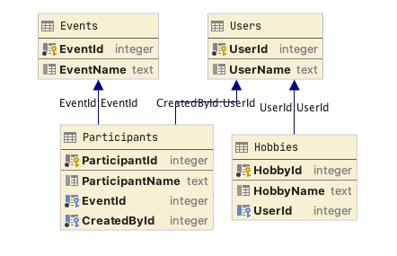

# EF Core 5 AsSplitQuery Performance Issue

This repo highlights critical difference between split queries in EF Core 2 and EF Core 5. The change in behaviour makes
it very hard to upgrade without rewriting a lot of existing queries.

## Problem

Major performance issues after upgrading to EF Core 5.

Queries with lots of `Include()` that use to return 1K+ rows with EF Core 2, return 100K+ rows with EF Core 5. Most of
the rows have duplicate details.

## Setup

This repo contains a simple DB Model showcasing the performance issue


There are 3 configurations available to be able to run the same code with different version of EF Core:

- EfCore2  (2.2.6)
- EfCore5 (5.0.5)
- EfCore6 (latest nightly 6.0.0-preview.5.21228.4)

When I query `Events` including `Participants`, `CreatedBy` and `Hobbies`, EF Core 2 makes 3 queries which return
1 `Event`, 3 `Participants` and 3 `Hobbies`.

<details>
<summary>EF Core 2 output</summary>

```
EF Core Version 2.2.6-servicing-10079
Executed DbCommand (0ms) [Parameters=[], CommandType='Text', CommandTimeout='30']
SELECT "x"."EventId", "x"."EventName"
FROM "Events" AS "x"
WHERE "x"."EventId" = 1
ORDER BY "x"."EventId"

Results:
----------------------- 
| EventId | EventName |
----------------------- 
| 1       | Event 1   |
----------------------- 

Count: 1

Executed DbCommand (0ms) [Parameters=[], CommandType='Text', CommandTimeout='30']
SELECT "x.Participants"."ParticipantId", "x.Participants"."CreatedById", "x.Participants"."EventId", "x.Participants"."ParticipantName", "p.CreatedBy"."UserId", "p.CreatedBy"."UserName"
FROM "Participants" AS "x.Participants"
INNER JOIN "Users" AS "p.CreatedBy" ON "x.Participants"."CreatedById" = "p.CreatedBy"."UserId"
INNER JOIN (
SELECT "x0"."EventId"
FROM "Events" AS "x0"
WHERE "x0"."EventId" = 1
) AS "t" ON "x.Participants"."EventId" = "t"."EventId"
ORDER BY "t"."EventId", "p.CreatedBy"."UserId"

Results:
------------------------------------------------------------------------------- 
| ParticipantId | CreatedById | EventId | ParticipantName | UserId | UserName |
------------------------------------------------------------------------------- 
| 1             | 1           | 1       | Participant 1   | 1      | User 1   |
------------------------------------------------------------------------------- 
| 2             | 1           | 1       | Participant 2   | 1      | User 1   |
------------------------------------------------------------------------------- 
| 3             | 1           | 1       | Participant 3   | 1      | User 1   |
------------------------------------------------------------------------------- 

Count: 3

Executed DbCommand (0ms) [Parameters=[], CommandType='Text', CommandTimeout='30']
SELECT "p.CreatedBy.Hobbies"."HobbyId", "p.CreatedBy.Hobbies"."HobbyName", "p.CreatedBy.Hobbies"."UserId"
FROM "Hobbies" AS "p.CreatedBy.Hobbies"
INNER JOIN (
SELECT DISTINCT "p.CreatedBy0"."UserId", "t0"."EventId"
FROM "Participants" AS "x.Participants0"
INNER JOIN "Users" AS "p.CreatedBy0" ON "x.Participants0"."CreatedById" = "p.CreatedBy0"."UserId"
INNER JOIN (
SELECT "x1"."EventId"
FROM "Events" AS "x1"
WHERE "x1"."EventId" = 1
) AS "t0" ON "x.Participants0"."EventId" = "t0"."EventId"
) AS "t1" ON "p.CreatedBy.Hobbies"."UserId" = "t1"."UserId"
ORDER BY "t1"."EventId", "t1"."UserId"

Results:
--------------------------------- 
| HobbyId | HobbyName  | UserId |
--------------------------------- 
| 1       | Crocheting | 1      |
--------------------------------- 
| 2       | Beatboxing | 1      |
--------------------------------- 
| 3       | Witchcraft | 1      |
--------------------------------- 

Count: 3
```

</details>


However, EF Core 5 and 6 return much larger result set:
1 `Event`, 3 `Participants` and **9** `Hobbies`.

<details>
<summary>EF Core 5 output</summary>

```
EF Core Version 5.0.5
Executed DbCommand (0ms) [Parameters=[], CommandType='Text', CommandTimeout='30']
SELECT "e"."EventId", "e"."EventName"
FROM "Events" AS "e"
WHERE "e"."EventId" = 1
ORDER BY "e"."EventId"

Results:
 ----------------------- 
 | EventId | EventName |
 ----------------------- 
 | 1       | Event 1   |
 ----------------------- 

 Count: 1

Executed DbCommand (0ms) [Parameters=[], CommandType='Text', CommandTimeout='30']
SELECT "t"."ParticipantId", "t"."CreatedById", "t"."EventId", "t"."ParticipantName", "t"."UserId", "t"."UserName", "e"."EventId"
FROM "Events" AS "e"
INNER JOIN (
    SELECT "p"."ParticipantId", "p"."CreatedById", "p"."EventId", "p"."ParticipantName", "u"."UserId", "u"."UserName"
    FROM "Participants" AS "p"
    INNER JOIN "Users" AS "u" ON "p"."CreatedById" = "u"."UserId"
) AS "t" ON "e"."EventId" = "t"."EventId"
WHERE "e"."EventId" = 1
ORDER BY "e"."EventId", "t"."ParticipantId", "t"."UserId"

Results:
 ----------------------------------------------------------------------------------------- 
 | ParticipantId | CreatedById | EventId | ParticipantName | UserId | UserName | EventId |
 ----------------------------------------------------------------------------------------- 
 | 1             | 1           | 1       | Participant 1   | 1      | User 1   | 1       |
 ----------------------------------------------------------------------------------------- 
 | 2             | 1           | 1       | Participant 2   | 1      | User 1   | 1       |
 ----------------------------------------------------------------------------------------- 
 | 3             | 1           | 1       | Participant 3   | 1      | User 1   | 1       |
 ----------------------------------------------------------------------------------------- 

 Count: 3

Executed DbCommand (0ms) [Parameters=[], CommandType='Text', CommandTimeout='30']
SELECT "h"."HobbyId", "h"."HobbyName", "h"."UserId", "e"."EventId", "t"."ParticipantId", "t"."UserId"
FROM "Events" AS "e"
INNER JOIN (
    SELECT "p"."ParticipantId", "p"."EventId", "u"."UserId"
    FROM "Participants" AS "p"
    INNER JOIN "Users" AS "u" ON "p"."CreatedById" = "u"."UserId"
) AS "t" ON "e"."EventId" = "t"."EventId"
INNER JOIN "Hobbies" AS "h" ON "t"."UserId" = "h"."UserId"
WHERE "e"."EventId" = 1
ORDER BY "e"."EventId", "t"."ParticipantId", "t"."UserId"

Results:
 -------------------------------------------------------------------- 
 | HobbyId | HobbyName  | UserId | EventId | ParticipantId | UserId |
 -------------------------------------------------------------------- 
 | 1       | Crocheting | 1      | 1       | 1             | 1      |
 -------------------------------------------------------------------- 
 | 2       | Beatboxing | 1      | 1       | 1             | 1      |
 -------------------------------------------------------------------- 
 | 3       | Witchcraft | 1      | 1       | 1             | 1      |
 -------------------------------------------------------------------- 
 | 1       | Crocheting | 1      | 1       | 2             | 1      |
 -------------------------------------------------------------------- 
 | 2       | Beatboxing | 1      | 1       | 2             | 1      |
 -------------------------------------------------------------------- 
 | 3       | Witchcraft | 1      | 1       | 2             | 1      |
 -------------------------------------------------------------------- 
 | 1       | Crocheting | 1      | 1       | 3             | 1      |
 -------------------------------------------------------------------- 
 | 2       | Beatboxing | 1      | 1       | 3             | 1      |
 -------------------------------------------------------------------- 
 | 3       | Witchcraft | 1      | 1       | 3             | 1      |
 -------------------------------------------------------------------- 

 Count: 9
```

</details>

While `6` additional rows is not a big problem, it becomes a major issue on larger datasets, essentially exploding the
number of rows returned from 1k to 100k

This repo uses Sqlite but this issue can be replicated with SQL Server.
